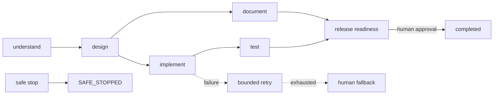

# Architecture and orchestration model

## Components

`ShortUrlController` owns the CRUD/analytics API. `RedirectController` resolves `/{shortCode}` with a 302 and stores a `UrlAccess` event. Spring Data JPA persists `ShortUrl`, `UrlAccess`, workflows, workflow nodes, and audit events to the H2 in-memory database.

`WorkflowService` is intentionally an in-process prototype of an agentic SDLC control plane. It does not make unbounded tool calls or deploy software. Instead it persists decisions and controls the lifecycle of generated engineering work. This is the autonomy boundary: a service account may prepare artifacts and evidence; a named human approves release readiness.

## State and control flow

Nodes are a persisted dependency graph, not a linear queue. `test` and `document` are synchronized only at `release-readiness`. Each node has an entry gate (its predecessors succeeded) and an exit state. All state transitions write a timestamped audit event, carrying actor identity and contextual decision/outcome.

## Governance and failure handling

- `release-readiness` is an approval gate and cannot auto-complete.
- `safe-stop` immediately prevents future execution; it leaves evidence intact for review.
- Failures have a two-attempt bound. Exhaustion marks a human fallback rather than silently continuing.
- `replan` increments the plan version and invalidates downstream implementation/test/document evidence while retaining upstream design lineage.
- Workflow metrics expose success rate, retry count, fallback count, and safe-stop frequency. In a production deployment, persistence/audit events would be exported to a metrics backend to calculate MTTR and latency percentiles.

## Security and production hardening

The supplied H2 console is development-only. Production needs an authenticated database, encryption/secrets management, caller authentication/authorization, URL allow/deny policies to prevent redirect abuse, rate limiting, immutable/centralized audit retention, optimistic locking, and distributed orchestration workers. H2 is deliberately chosen here only to keep the assignment executable without infrastructure.
